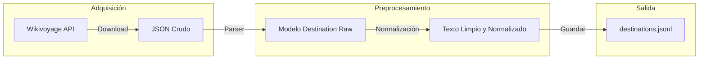

# 04 - Adquisición de Datos

Este documento detalla las fuentes de datos, el esquema de información y los procesos de limpieza y normalización aplicados a los destinos turísticos.

## Modelo de Datos `Destination`

Toda la información recolectada de diversas fuentes se unifica bajo el modelo `Destination`, implementado mediante Pydantic en `src/ingestion/models.py`.

### Esquema de Datos

| Campo | Tipo | Descripción |
|-------|------|-------------|
| `id` | `str` | Identificador único del destino (slug o hash). |
| `name` | `str` | Nombre oficial del destino. |
| `country` | `str` | País al que pertenece el destino. |
| `region` | `str` (opcional) | Región, estado o provincia. |
| `description` | `str` | Descripción textual extensa del destino. |
| `tags` | `List[str]` | Etiquetas o categorías (ej. playa, museos). |
| `image_urls` | `List[HttpUrl]` | URLs de imágenes representativas. |
| `coordinates` | `Tuple[float, float]` (opcional) | Latitud y longitud geográfica. |
| `source` | `str` | Nombre de la fuente de datos (ej. wikivoyage). |
| `fetched_at` | `datetime` | Marca de tiempo de adquisición de los datos. |

### Validación
El modelo utiliza validación estricta de tipos (incluyendo la validez de las URLs) y asegura que los campos críticos no estén vacíos. Se pueden encontrar las pruebas correspondientes en `tests/test_ingestion.py`.

## Fuentes de Datos

### 1. Wikivoyage
[Wikivoyage](https://en.wikivoyage.org/) es una guía de viajes libre, escrita de forma colaborativa por voluntarios. Es una fuente ideal para este proyecto debido a:
- **Estructura del Dominio**: Los artículos están organizados por destinos (ciudades, regiones), facilitando la creación del catálogo.
- **Multimodalidad**: Contiene referencias a imágenes de alta calidad de Wikimedia Commons.
- **Licencia**: Publicado bajo **CC BY-SA 3.0**, permitiendo su uso y transformación siempre que se atribuya y se comparta bajo la misma licencia.

#### Adquisición de Wikivoyage (MVP)
Para el desarrollo inicial, se ha implementado un pipeline de adquisición ligero:
1. **Descarga (`scripts/download_wikivoyage.py`)**: Utiliza la API de MediaWiki para obtener el contenido crudo (wikitext) de destinos seleccionados de España en formato JSON.
2. **Parsing (`src/ingestion/wikivoyage.py`)**: Procesa el wikitext, extrae coordenadas geográficas, limpia etiquetas y genera objetos `Destination` unificados en `data/raw/destinations_raw.jsonl`.

#### Diagrama del Pipeline



La implementación coordinada se encuentra en `src/ingestion/pipeline.py`.

### Estadísticas del Corpus (Corte 1)

Tras la ejecución del pipeline de ingestión sobre Wikivoyage para destinos en España, el estado del corpus es el siguiente:

| Métrica | Valor |
|---------|-------|
| **Total de destinos** | 50 |
| **Países cubiertos** | España (50) |
| **Longitud media descripción** | 606.88 caracteres |
| **Fuente dominante** | Wikivoyage |

Estas estadísticas se generan mediante el script `scripts/stats.py`.

---

## 2. Fusión y deduplicación de fuentes

A partir de la tarea T018, el sistema soporta la integración de múltiples fuentes de datos (ej. Wikivoyage, OpenTripMap). Para evitar duplicados, se implementa una deduplicación basada en nombre y proximidad geográfica:

- **Criterio de duplicado**: Dos destinos se consideran duplicados si su nombre coincide (ignorando mayúsculas/minúsculas y espacios) y la distancia Haversine entre sus coordenadas es menor a 1 km.
- **Fusión de campos**: Al fusionar, se unen las listas de etiquetas (`tags`) e imágenes (`image_urls`). Se añade un campo `sources` (lista) con los nombres de todas las fuentes que aportaron información sobre ese destino.

### Algoritmo de deduplicación

```python
from src.ingestion.merger import merge_destinations

# Uso:
# merged = merge_destinations([wikivoyage_list, opentripmap_list])
```

La función `merge_destinations` recorre todas las listas de destinos, compara cada destino con los ya fusionados y aplica la deduplicación según el criterio anterior. Si encuentra un duplicado, fusiona los campos relevantes; si no, lo añade como nuevo.

#### Fórmula de distancia Haversine

$$
d = 2R \arcsin\left( \sqrt{ \sin^2\left(\frac{\varphi_2-\varphi_1}{2}\right) + \cos\varphi_1 \cos\varphi_2 \sin^2\left(\frac{\lambda_2-\lambda_1}{2}\right) } \right)
$$

Donde $R$ es el radio de la Tierra (6371 km), $(\varphi, \lambda)$ son latitud y longitud en radianes.

#### Ejemplo de uso

```python
from src.ingestion.models import Destination
from src.ingestion.merger import merge_destinations

# Suponiendo que tienes dos listas de destinos de diferentes fuentes:
merged = merge_destinations([wikivoyage_destinations, opentripmap_destinations])
```

---
