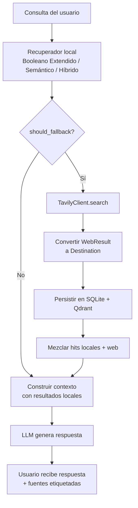

# 9. Búsqueda Web Fallback

## 9.1 Motivación

El corpus local de destinos turísticos cubre un conjunto finito de lugares, principalmente extraídos de Wikivoyage y OpenTripMap. Cuando un usuario realiza una consulta sobre un destino poco conocido, una festividad reciente o un lugar que no fue indexado, el sistema devuelve resultados con scores bajos o directamente vacíos.

Para evitar respuestas vacías o de baja calidad, la Fase 6 introduce un mecanismo de **fallback a búsqueda web**: si los resultados locales son insuficientes, el sistema consulta automáticamente la API de Tavily y enriquece el contexto del LLM con información actualizada de la web.

## 9.2 Justificación de Tavily

Tavily es una API de búsqueda diseñada específicamente para aplicaciones RAG. Sus ventajas sobre alternativas (SerpAPI, DuckDuckGo, Bing):

- Devuelve fragmentos (`content`) ya optimizados para consumo por LLMs.
- Plan gratuito generoso (1000 llamadas/mes) adecuado para prototipado académico.
- Respuesta estructurada JSON con título, URL y contenido por resultado.
- Sin necesidad de parsear HTML ni manejar rate limits de scraping.

## 9.3 Lógica del trigger (T074)

La función `should_fallback(hits, low_confidence, threshold)` en `src/web_search/trigger.py` determina si se activa la búsqueda web:

```
fallback = True  si:
  - hits está vacío
  - max(score para doc_id, score en hits) < threshold
  - low_confidence == True  (el LLM indicó falta de información en una llamada previa)
```

El umbral por defecto es `0.30` y es configurable desde `.env` mediante `TAVILY_FALLBACK_SCORE_THRESHOLD`.

## 9.4 Diagrama de la pipeline con fallback



## 9.5 Conversión WebResult → Destination (T076)

`src/web_search/converter.py` implementa una conversión *best-effort*:

| Campo Destination | Fuente Tavily | Observación |
|---|---|---|
| `id` | hash SHA256(URL)[:12] prefijado `web-` | Idempotente: misma URL → mismo ID |
| `name` | `title` del resultado | — |
| `description` | `content` del fragmento | Si vacío, usa `title` |
| `country` | `"web"` | No inferible sin NER |
| `source` | `"tavily"` | — |
| `coordinates` | `None` | No disponible |
| `image_urls` | `[]` | No disponible desde búsqueda básica |

**Limitaciones:** Los destinos web son parciales. No tienen coordenadas, región ni imágenes. Son útiles para el contexto del LLM pero no para el mapa interactivo (T104).

## 9.6 Estrategia de aprendizaje continuo (T077)

`src/web_search/persister.py` persiste cada `Destination` web en:

1. **SQLite** (via `upsert_destination`): el destino queda disponible para futuras recuperaciones booleanas.
2. **Qdrant** (via `store.upsert`): se embebe la descripción y se indexa, haciendo que búsquedas semánticas futuras también encuentren el destino.

El ID derivado del hash de URL garantiza que si la misma URL aparece en dos búsquedas distintas, no se crea un duplicado. Los errores de persistencia se capturan silenciosamente y se loguean en `WARNING` para no interrumpir la respuesta al usuario.

## 9.7 Política de rate limiting (T079)

`RateLimiter` en `src/web_search/tavily.py` implementa una ventana deslizante:

- Se registra el timestamp de cada llamada en una cola (`deque`).
- Antes de cada llamada, se eliminan timestamps fuera de la ventana de 60 segundos.
- Si el número de llamadas activas es mayor o igual a `max_calls`, se lanza `RuntimeError`.
- El pipeline captura este error y retorna los hits locales (posiblemente vacíos) sin interrumpir la respuesta.

Configuración: `TAVILY_RATE_LIMIT_PER_MINUTE=20` (por defecto).

| Parámetro | Variable de entorno | Default |
|---|---|---|
| Umbral de score | `TAVILY_FALLBACK_SCORE_THRESHOLD` | `0.30` |
| Llamadas por minuto | `TAVILY_RATE_LIMIT_PER_MINUTE` | `20` |
| API key | `TAVILY_API_KEY` | — (obligatoria para activar fallback) |

Si `TAVILY_API_KEY` no está configurada, el cliente web no se inicializa y el fallback queda desactivado.

## 9.8 Indicador visual en la UI (T078)

Los resultados provenientes de Tavily incluyen `from_web=True` en `DestinationResult`. La UI Streamlit muestra el badge `[Busqueda web]` junto al nombre del destino en las tarjetas y en la lista de fuentes del tab "Preguntar".

## 9.9 Casos de prueba (T080)

| Test | Condición | Resultado esperado |
|---|---|---|
| `test_fallback_triggered_when_no_local_results` | Índice vacío | `sources` no vacío (resultados web) |
| `test_fallback_source_has_from_web_true` | Fallback activado | Al menos una fuente con `from_web=True` |
| `test_fallback_not_triggered_without_web_client` | `web_client=None` | `from_web=False` en todas las fuentes |
| `test_fallback_rate_limited_graceful_degradation` | Rate limit agotado | Respuesta válida (sin crash) |
| `test_fallback_result_name_is_tavily_title` | Resultado web | `name` == título de Tavily |
| `test_fallback_does_not_trigger_when_scores_are_high` | Score local >= 0.30 | Tavily no es consultado |
