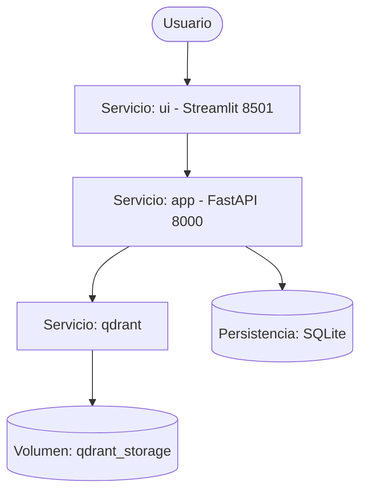

# 15 - Despliegue y Requisitos

Este documento detalla los requisitos técnicos y los pasos necesarios para desplegar el Smart Tourism Engine en diferentes entornos.

## Requisitos del Sistema

### Software Base
- **Python**: Versión 3.11 o superior.
- **Docker & Docker Compose**: Necesarios para el despliegue de la base vectorial (Qdrant) y la contenedorización de la aplicación.
- **Git**: Para el control de versiones y gestión del código fuente.

## Instalación del Entorno de Desarrollo

1. **Clonar el repositorio**:
   ```bash
   git clone <url-del-repositorio>
   cd smart-tourism-engine
   ```

2. **Crear y activar entorno virtual**:
   ```bash
   python -m venv venv
   source venv/bin/activate  # En Linux/macOS
   # o
   .\venv\Scripts\activate   # En Windows
   ```

3. **Instalar dependencias**:
   El proyecto utiliza `pyproject.toml` para gestionar las dependencias. Puedes instalarlo en modo editable con:
   ```bash
   pip install -e .
   ```

   Para instalar también las herramientas de desarrollo (linting, tests):
   ```bash
   pip install -e ".[dev]"
   ```

   Como respaldo, también se incluye un archivo `requirements.txt`:
   ```bash
   pip install -r requirements.txt
   ```

## Estructura de Dependencias Clave
- **FastAPI**: Framework web para la API.
- **Pydantic**: Validación de datos y configuraciones.
- **Pytest**: Framework de pruebas unitarias.
- **Ruff/Black/Isort**: Herramientas de calidad de código y formateo.

## Variables de Entorno

El sistema se configura a través de variables de entorno que pueden definirse en un archivo `.env` en la raíz del proyecto. Estas son gestionadas mediante Pydantic Settings en `src/config.py`.

| Variable | Descripción | Valor por Defecto |
|----------|-------------|-------------------|
| `QDRANT_URL` | Dirección de la base vectorial Qdrant. | `http://localhost:6333` |
| `LLM_API_KEY` | Clave API para el servicio LLM (ej. Groq). | `None` |
| `LOG_LEVEL` | Nivel de verbosidad de los logs del sistema. | `INFO` |
| `DATA_DIR` | Ruta base para el almacenamiento de datos. | `data` |

Para configurar estas variables, copia el ejemplo:
```bash
cp .env.example .env
```
Y edita los valores según sea necesario.

## Imagen Docker

El sistema está diseñado para ejecutarse en contenedores Docker, lo que garantiza la portabilidad y la consistencia entre entornos.

- **Imagen Base**: `python:3.11-slim`. Se ha elegido la variante `slim` para minimizar el tamaño de la imagen final y reducir la superficie de ataque, manteniendo solo lo esencial para ejecutar Python.
- **Optimización de Capas**:
  1. Instalación de dependencias del sistema mínimas.
  2. Copia e instalación de dependencias de Python (aprovechando la caché de Docker).
  3. Copia del código fuente del proyecto.
- **Variables de Entorno**: El contenedor respeta las variables pasadas durante el `docker run` o vía `docker-compose`.

Para construir la imagen localmente:
```bash
docker build -t smart-tourism-engine -f docker/Dockerfile .
```

## Orquestación con Docker Compose

El despliegue completo se gestiona con `docker-compose.yml`, que orquestra los siguientes servicios:



- **`app`**: expone la API FastAPI en `:8000`. Arranca con
  `uvicorn src.api.main:app`.
- **`ui`**: levanta la UI de Streamlit (T046) en `:8501` y consume la API vía
  `SMART_TOURISM_API_URL=http://app:8000`. Tras `docker compose up` la
  interfaz queda disponible en `http://localhost:8501`.
- **`qdrant`**: base vectorial, compartida por `app`.

### Comandos de gestión

- **Iniciar el sistema**:
  ```bash
  docker compose up -d --build
  ```

- **Ver logs**:
  ```bash
  docker compose logs -f app
  ```

- **Detener el sistema**:
  ```bash
  docker compose down
  ```

### Persistencia de Datos
Se han configurado los siguientes volúmenes para asegurar que la información no se pierda al reiniciar contenedores:
- `./data/qdrant_storage`: Persistencia de los vectores en Qdrant.
- `./data`: Persistencia del catálogo SQLite y archivos procesados en el contenedor de la aplicación.
